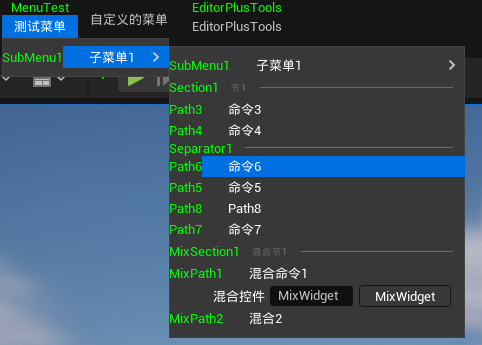
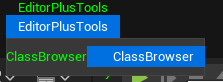
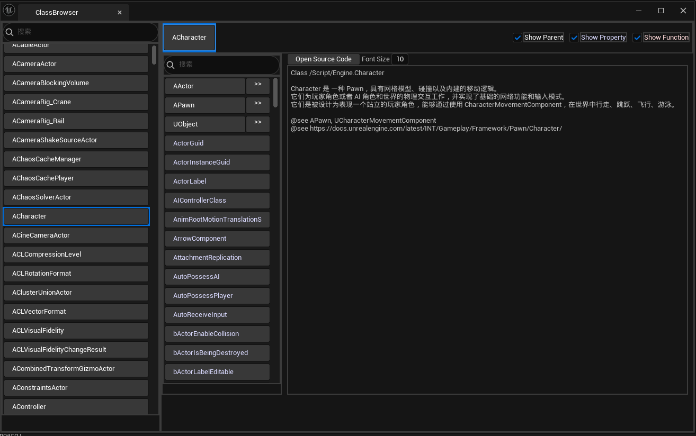
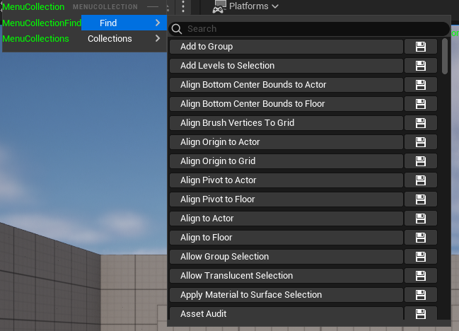
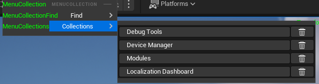

# UE.EditorPlus

[English](README.en.md) | [简体中文](README.md)

## Introduction

UE.EditorPlus is a plugin for Unreal Engine that facilitates the extension of the editor menu and adds some practical editor tools.

## Detailed Documentation

中文：[UE 编辑器插件 UE.EditorPlus 说明文档](https://disenone.github.io/wiki/ue-%E7%BC%96%E8%BE%91%E5%99%A8%E6%8F%92%E4%BB%B6-EditorPlus/)

English: [UE Editor Plugin UE.EditorPlus Documentation](https://disenone.github.io/wiki/en/ue-%E7%BC%96%E8%BE%91%E5%99%A8%E6%8F%92%E4%BB%B6-EditorPlus/)

## Extending the Editor Menu

Supports path-based menu extension, instantiated menu extension, and mixed menu extension.

```cpp
FEditorPlusPath::RegisterPathAction(
    "/<MenuBar>Bar/<SubMenu>SubMenu/<Command>Action",
    FExecuteAction::CreateLambda([]
        {
            // perform action
        })
);
```



## Practical Tools

### ClassBrowser





### MenuCollection

Quickly find and collect editor menu commands




